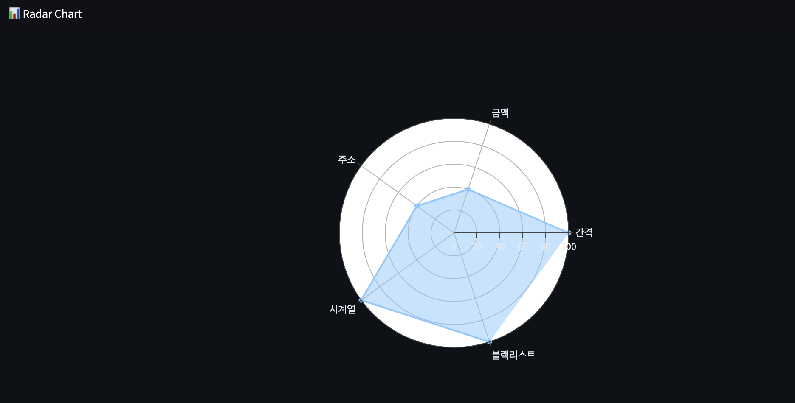
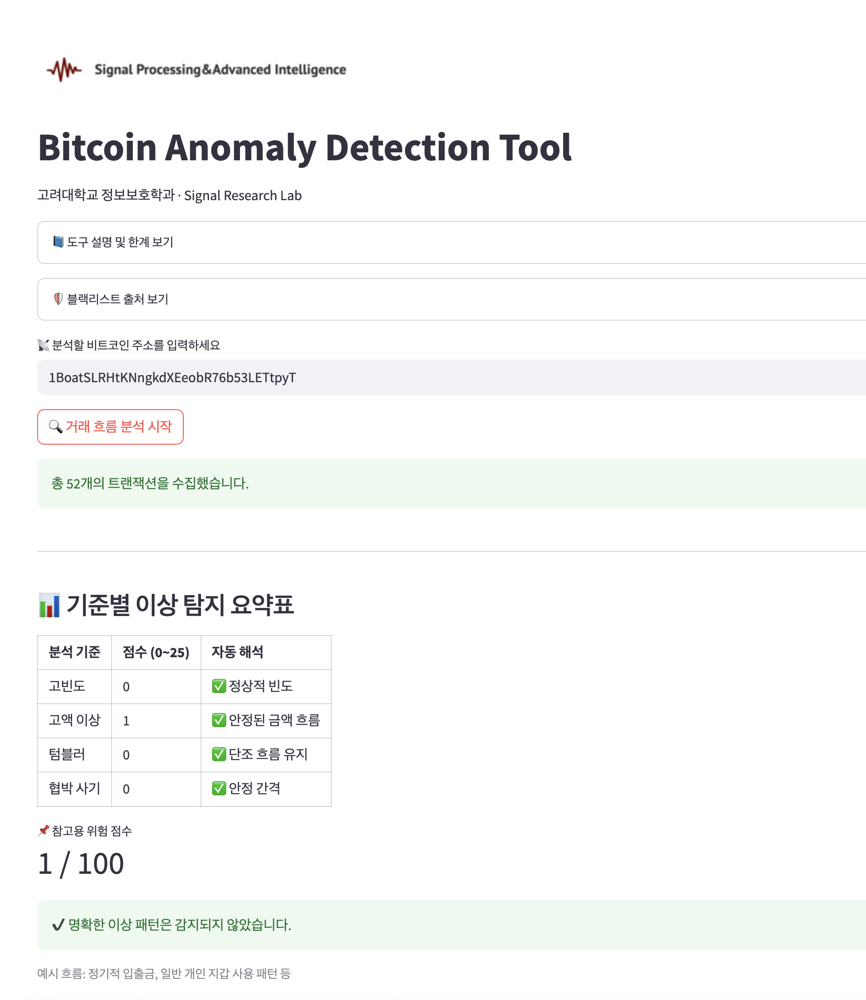

# 🧠 BTC Anomaly Lens

> A real-time Bitcoin anomaly detection platform for blockchain forensic research, education, and cybersecurity intelligence.

---

## 💡 Overview

**BTC Anomaly Lens** is a modular, real-time anomaly detection platform designed for:

- 🔍 Blockchain threat analysis
- 🛡️ Security portfolio demonstration
- 🧪 Research and academic education

The system supports **dual deployment**:
- 🌐 **Portfolio version** with dynamic UI and multi-logic scoring
- 🏫 **Free lab version** for education and research labs with no paid API usage

Built and designed by **You Jin Kim**, a cybersecurity researcher specializing in blockchain forensics and anomaly detection.

---

## 🚀 Live Demos

| Version | Link | Description |
|--------|------|-------------|
| 🌐 Portfolio App | [btc-anomaly-lens.streamlit.app](https://btc-anomaly-lens.streamlit.app/) | Real-time scoring, blacklist detection, multilingual UI |
| 🏫 Lab Version | [btc-anomaly-korea-signal.streamlit.app](https://btc-anomaly-korea-signal.streamlit.app/) | Educational version using free API, deployed in university labs |

---

## 🔍 Core Features

| Detection Logic | Description |
|------------------|-------------|
| ⏱ **Time Interval** | Detects repeated transfers within 60 seconds |
| 💰 **Amount Outliers** | Flags high-value anomalies using IQR logic |
| 🔁 **Repeated Address Pattern** | Detects repeated recipients (≥3 times) |
| 📈 **Time Gap Extremes** | Flags gaps <10s or >1 hour |
| 🚨 **Blacklist Matching** | Matches addresses against sanctions/risk list |

🧮 Each logic produces a modular risk score.  
All components are visualized via:

- 📊 Radar chart
- 🍩 Donut breakdown
- 📦 Box plot
- 📉 Histogram

---

## 🖼️ Screenshots

  
*Interactive radar chart & score breakdown UI*

  
*Simplified research version for classrooms*

---

## 🛠️ Tech Stack

- **Frontend**: Streamlit (bilingual UI)
- **Backend**: Python, Pandas, NumPy
- **Visualization**: Plotly
- **API**: BlockCypher (Free/Token mode)
- **Deployment**: GitHub + Streamlit Cloud

---

## 📁 Project Structure

btc-anomaly-lens/
├── app.py
├── logic/
│ └── detection.py
├── api/
│ ├── fetch.py
│ └── parser.py
├── ui/
│ ├── layout.py
│ └── language.py
├── data/
│ └── blacklist.txt
├── docs/
│ ├── preview_ui_dashboard.png
│ ├── preview_lab_ui.png
│ └── You Jin Kim — Resume.pdf
└── requirements.txt

---

## 👤 About the Creator

**You Jin Kim (김유진)**  
M.S. in Information Security, Korea University  
✉️ youjin.kim@korea.ac.kr  
🔗 [GitHub Profile](https://github.com/u0jin)  
📄 [View Resume (PDF)](https://github.com/u0jin/btc-anomaly-lens/blob/main/docs/%F0%9F%93%84%20You%20Jin%20Kim%20%E2%80%94%20Resume.pdf)

---

## 🧠 Vision

> “This project reflects not only technical capability, but also the ability to define problems, design logic, and ship usable cybersecurity tools.”

It is meant to serve as:

- A practical portfolio in blockchain analytics
- A demo for real-time risk logic and UX thinking
- A reproducible research toolkit for education

---

## 📜 License

MIT License — free to use, modify, and distribute for any purpose, as long as attribution is given to the original author.

---
